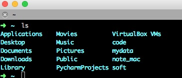

# Oh My Zsh的使用
>Mac 的最大优势是 GUI 和命令行的完美结合.

所以可见选择一个好的shell是一件很重要的事，简单来说，Shell是Linux/Unix的一个外壳，你理解成衣服也行。它负责外界与Linux内核的交互，接收用户或其他应用程序的命令，然后把这些命令转化成内核能理解的语言，传给内核，内核是真正干活的，干完之后再把结果返回用户或应用程序。

## 基本介绍

常用的Shell有这么几种，sh,bash,csh等，想知道自己系统有几种shell,可以通过以下命令查看:

    cat /etc/shells
    # List of acceptable shells for chpass(1).
    # Ftpd will not allow users to connect who are not using
    # one of these shells.

    /bin/bash
    /bin/csh
    /bin/ksh
    /bin/sh
    /bin/tcsh
    /bin/zsh
    /usr/local/bin/zsh


## 安装zsh

如果你用 Mac，就可以直接看下一节
如果你用 Redhat Linux，执行：sudo yum install zsh
如果你用 Ubuntu Linux，执行：sudo apt-get install zsh
如果你用 Windows……去洗洗睡吧。

安装完成后设置当前用户使用 zsh：chsh -s /bin/zsh，根据提示输入当前用户的密码就可以了。

- 安装oh my zsh

首先安装 git，安装方式同上，把 zsh 换成 git 即可。

安装「oh my zsh」可以自动安装也可以手动安装。

- 自动安装：
```
wget https://github.com/robbyrussell/oh-my-zsh/raw/master/tools/install.sh -O - | sh
```
- 手动安装：
```
git clone git://github.com/robbyrussell/oh-my-zsh.git ~/.oh-my-zsh
cp ~/.oh-my-zsh/templates/zshrc.zsh-template ~/.zshrc
```
都不复杂，安装完成之后退出当前会话重新打开一个终端窗口，你就可以见到这个彩色的提示了：



## 配置

zsh 的配置主要集中在用户当前目录的.zshrc里，用 vim 或你喜欢的其他编辑器打开.zshrc，在最下面会发现这么一行字：

    # Customize to your needs…


## 参考文档

[终极Shell --ZSH](http://zhuanlan.zhihu.com/mactalk/19556676)

[GitHub oh-my-zsh](https://github.com/robbyrussell/oh-my-zsh)